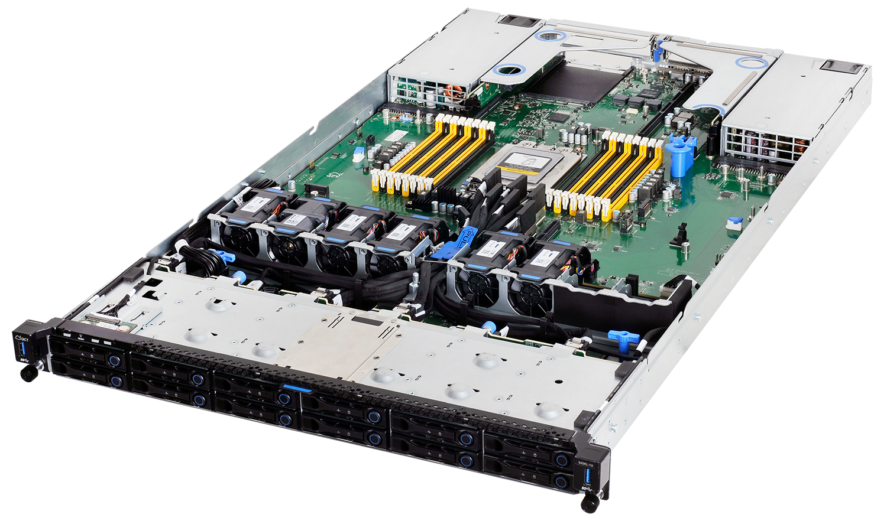
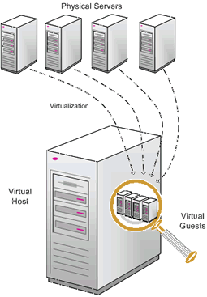
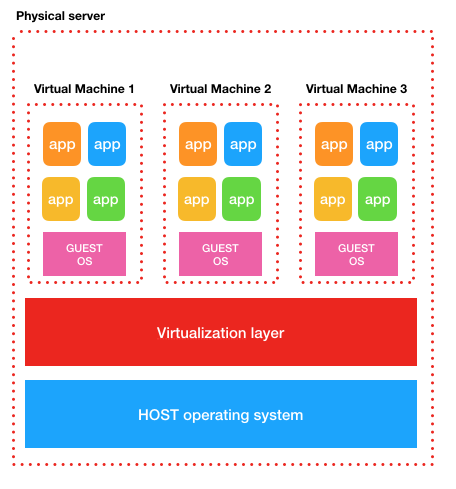

 <!-- .element width="70%" -->

---

### Définiton

> Docker est un outil de gestion de **conteneurs applicatifs**.

----

### Origine

- Dévoilé en mars 2013 par la société éponyme
- Est considéré comme une révolution !

----

### Utilité

- Permet de lancer des environnements isolés : **conteneurs**
- Déployables sur n'importe quel serveur !
- Basé sur Linux

> Docker est comparable à la virtualisation, en mieux !

----

### Révolution !

- Considéré comme une **virtualisation légère**
- Installation et démarrage très rapide (quelques secondes)
- Consomme très peu de ressources

---

# Histoire
## Bare metal > virtualisation > conteneurisation

 <!-- .element width="70%" -->

----

### Les serveurs bare metal

 <!-- .element width="30%"-->

- Serveur physique dédié à une application
- Estimation de la puissance nécessaire difficile
- Amélioration de la puissance = achat de nouveaux serveurs

----

### Bare metal
## Douleurs récurrentes

- **Sous-exploitation** des serveurs
- **Coûts** de maintenance et d'exploitation élevés
- **Temps** de déploiement longs
- **Difficulté** de mise à l'échelle
- Pas de **portabilité** des applications
- Pas d'**isolation** des applications

----

### Virtualisation
## Origines

- Développée dans les années 60 par IBM
- Popularisée par VMWare dans les années 90
- S'est démocratisée dans les années 2000
- Intégrée à Windows grâce à Hyper-V

----

### Virtualisation
## Fonctionnement

- Un **HyperVisor** (HV) est installé sur un serveur (**Hôte**)
- Des ressources (RAM, CPU, stockage) sont allouées à des **VMs**
- Chaque VM est **isolée** des autres

----

### Virtualisation
## Avantages

- **Isolation** des applications
- **Portabilité** des applications (export de VM)
- **Mise à l'échelle** facilitée
- Un ordinateur = plusieurs ordinateurs

----

### La virtualisation
## Concept

 <!-- .element width="30%" align="left" -->

- Ordinateurs virtuels...
- ...dans un ordinateur
- Géré par un **hyperviseur**

----

### Virtualisation
## Inconvénients

- **Lourd** : chaque VM contient un OS complet
- **Lent** : démarrage d'une VM = démarrage d'un OS
- **Coûteux** : Les ressources allouées ne sont plus disponibles
- **Volumineux** : Chaque image = une installation complète d'OS

> À l'époque, les SSD n'étaient pas très répandus !

----

### Virtualisation
## En image

 <!-- .element width="50%" -->

----

### Conteneurisation
## Révolution !

 <!-- .element width="70%" -->

> Voyez-vous la différence ?

----

### Conteneurisation
## Dans les grandes lignes

- Les conteneurs utilisent le kernel de l'OS hôte
- Il n'a pas besoin d'être réinstallé
- Démarrage **instantané**
- Pas besoin de bloquer des ressources !
- Les **images** sont très légères
- Partage facilité, sans problème de compatibilité

---

### Docker
## Quelques termes

- **Conteneur** : Espace épéhémère isolé pour l'exécution d'une application
- **Image** : Modèle de conteneur permettant la création
- **Dockerfile** : Fichier de configuration d'une image

----

### Docker
## Docker engine

- Le moteur de Docker
- Gère les conteneurs, les images, les réseaux, les volumes...
- Gère l'isolation, la sécurité, les ressources...

----

### Docker
## Docker client

- Permet de se connecter au moteur
- Peut être installé localement ou à distance
- Disponible en lignes de commandes
- Disponible en graphique (Docker Desktop)

----

### Docker
## DockerHub

- Librairie de conteneurs en ligne
- Permet de télécharger des images
- Permet de stocker/partager ses images

----

### Docker
## Image Docker

- Comparable à une définition de classe en POO
- Toujours en lecture seule
- Doit être présente localement

----

### Docker
## Conteneur

- Comparable à une instance d'une classe en POO
- Est l'espace dans lequel est exécutée l'application
- Contient une application et ses dépendances

----

### Docker
## Gardez en tête...

- Un conteneur est **dépendant** d'une image
- Un conteneur est **ephemère** !
- Un conteneur est **complet** et **indépendant**

---

### Installation
## Prérequis

- Docker est basé sur Linux
- Il y a quelques années, il fallait installer une VM Linux
- Grâce à WSL2, il est possible d'installer Docker sur Windows 10

----

### Installation
## Liens

- [Linux](https://docs.docker.com/engine/install/)
- [Windows](https://docs.docker.com/docker-for-windows/install/)
- [Mac](https://docs.docker.com/docker-for-mac/install/)

---

## La suite !

- [Premiers pas](./02_Permiers_pas.slides.md)