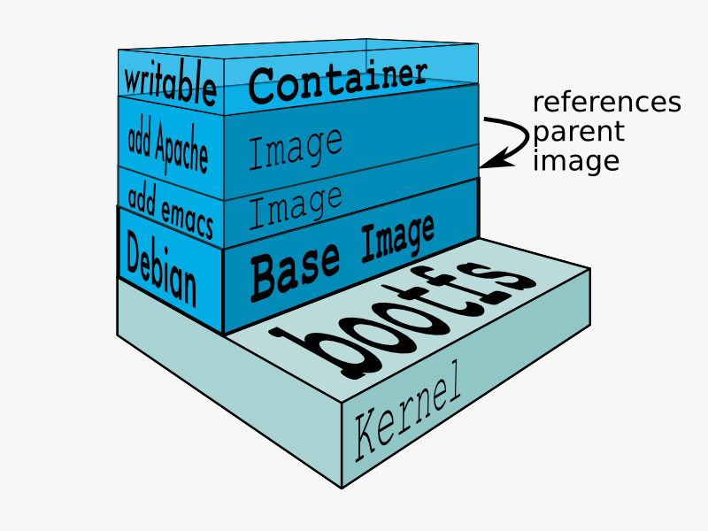

 <!-- .element width="70%" -->

---

# Images

- Une image est un **modèle** de conteneur.
- Une image est **immuable**.
- Une image est constituée de **couches**.
- Elles sont créées à partir d'un **Dockerfile**.

----

## Layers

 <!-- .element width="70%" -->

----

## Layers
#### bootfs

- Contient le **noyau** et les **fichiers de démarrage**.
- Ne peut être modifié.

----

## Layers
#### Debian

- Contient le système d'exploitation **Debian**.
- Ne peut être modifié.

----

## Layers
#### add emacs

- Contient l'installation d'**Emacs**.
- Dans cet exemple, il s'agit d'un **Dockerfile** avec une seule instruction `RUN apt-get install -y emacs`.
- Peut être modifié.

----

## Layers
#### add Apache

- Contient l'installation d'**Apache**.
- Dans cet exemple, il s'agit d'un **Dockerfile** avec une seule instruction `RUN apt-get install -y apache2`.
- Il a pour origine le layer `add emacs`.

----

## Layers
#### Container

- Couche qui représente le **conteneur**.
- Il a pour origine le layer `add Apache`.
- Il est **éphémère**.
- Il peut être modifié.

----

## Layers
#### Question

> Que se passe-t-il si je modifie un fichier dans le layer `Debian` ?  
> Ou si j'installe un nouveau package linux ?


----

## Layers
#### Réponse

- Le fichier est ajouté dans le layer `Container`.

----

## Layers
#### Question

> Que se passe-t-il si j'ai besoin de modifier un fichier dans le layer `add emacs` ?

----

## Layers
#### Réponse

- Le fichier est 'copié' dans le layer `Container`.
- La modification est faite dans la copie.
- Le fichier n'est pas copié si on ne fait que le lire.

> Plus le fichier est sur une couche haute, plus il est prioritaire.

---

# Dockerfile

- Un Dockerfile est un fichier de configuration d'une image.
- Il contient une liste d'instructions.
- C'est comme un script de création d'image.

----

## Dockerfile
#### Couches

- Un dockerfile créera les couches de l'image.
- Chaque instruction crée une couche*.
- La limite est de 127 couches.

> \* Chaque instruction qui nécessite une écriture dans le système de fichier linux.

----

## Dockerfile
#### Exemple

```dockerfile
FROM debian:latest # Image de base

RUN apt-get update && apt-upgrade -y # Met à jour linux
RUN apt-get install emacs # Installe emacs

CMD ["emacs"] # Exécute la commande `emacs` au démarrage du conteneur
```

> Combien de couches ?

Note: 2 couches !

----

## Dockerfile

Nous aborderons plus en détail les Dockerfile dans le chapitre associé.
Avant ça : les commandes de base !

---

# Commandes de base

Docker dispose de sa propre syntaxe :

```shell
docker [contexte] <verb> <cible> [--option(s)]
```

- `contexte` : optionnel, permet de spécifier le scope de la commande (conteneur, image, réseau...)
- `verb` : verbe de la commande (run, pull, create...)
- `cible` : cible de la commande (nom de l'image, du conteneur...)
- `option(s)` : option(s) de la commande (nom, réseau, volumes, ports...)

----

## Commandes de base
#### run

```shell
docker container run [OPTIONS] <nomImage>[:<version>] [COMMANDS] [ARG...]
```

- Crée et démarre un conteneur à partir d'une image.
- **options** : nom, réseau, volumes, ports... (`-d`, `-p`, `-v`, `--name`...)
- **< nomImage>[:< version > ]** : nom de l'image à utiliser, et optionnellement sa version.
- **commands** **arg** : commande à exécuter dans le conteneur (facultatif).

----

## Commandes de base
#### Quelques options de run

- `-d` : détache la console du conteneur
- `-p <port>:<port>` : Définit le port utilisé
- `-v <volume>` : Définit le volume utilisé
- `--name <nom>` : Définit le nom du conteneur
- `-it` : Permet d'interagir avec le conteneur

> [RTFM](https://docs.docker.com/engine/reference/commandline/container_run/)

Note: Par défaut, la dernière version de l'image sera téléchargée

----

# Démonstration

Création d'un conteneur nginx

Note: docker run -dit -p 80:80 nginx // Puis go localhost:80

----

## Commandes de base
#### Renommer un conteneur

```shell
docker container rename <CONTAINER> <NEW_NAME>
```

- Si aucun argument '--name' n'est spécifié, Docker crée un nom aléatoire.
- On doit régulièrement renommer les conteneurs si on souhaite les utiliser pour réaliser des images

----

## Démonstration

Renommer le conteneur nginx

Note: docker container rename nom_actuel NGINX_Demo

----

## Commandes de base
#### Autres commandes utiles

- `docker ps -a` : Liste les conteneurs (actifs ou non)
- `docker kill <CONTAINER>` : Arrête un conteneur (forcé)
- `docker rm <CONTAINER> [-f]` : Supprime un conteneur
- `docker container prune` : Supprime tous les conteneurs en 'dangling'

> Il existe beaucoup de commandes, voir la [doc](https://docs.docker.com/engine/reference/commandline/docker/)

----

# La suite !

[Volumes et Networks](04_Volumes_et_Networks.slides.md)