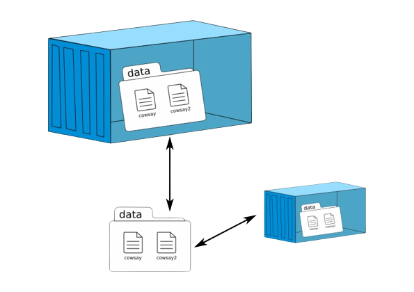

# Volumes

 <!-- .element width="70%" align="left" -->
 <!-- .element width="30%" align="right" -->

----

## Rappels

- Un conteneur est **éphémère**.
- Les données sont **perdues** à l'arrêt du conteneur.
- La couche de données est **en lecture seule**.

> Comment faire pour conserver des données ?


----

## Solution : les volumes

Les volumes permettent :
- La persistance des données
- Le partage des données

----

## Trois types de volumes

 <!-- .element width="40%" -->

- **Bind mount** : Montage d'un dossier de l'hôte dans le conteneur
- **Volume** : Montage d'un dossier dans le conteneur
- **tmpfs** : Montage d'un dossier en mémoire (linux uniquement)

----

## Bind mount
### Définition 

 <!-- .element width="30%" -->

- Dossier partagé entre l'hôte et le conteneur
- Fonctionne un peu comme un dossier partagé sur le réseau
- Les données sont stockées sur le système hôte

----

## Bind mount
### Syntaxe

- Que ce soit dans un `Dockerfile`, dans un `docker run ...` ou un `docker-compose.yml`, la syntaxe ressemblera à :

```shell
<chemin_hote>:<chemin_absolu_conteneur>
```

Exemple :
> `docker run -v $(pwd):/app ...`

----

## Bind mount
### Précisions

- Le dossier de l'hôte doit exister
- Le dossier du conteneur sera créé s'il n'existe pas
- Le contenu du dossier du conteneur sera écrasé par celui du dossier de l'hôte

----

## Bind mount
### Précisions

- Historiquement, c'était le seul type existant
- Il manque de stabilité, et peut entrainer des problèmes de droits sur certains OS
- **L'usage des Bind mount est déconseillé en production**
- Avec la commande `docker run`, il est préférable d'utiliser des **volumes**

----

## Volume
### Définition

- Contrairement au bind mount, le volume n'est pas lié à un dossier de l'hôte
- Les données sont stockées dans le filesystem de Docker
- Elles sont accessibles depuis tous les conteneurs qui utilisent le volume

----

## Volume
### Syntaxe

- La syntaxe est très similaire à celle du bind mount
- La différence se situe au niveau du chemin du conteneur

```shell
<chemin_absolu_conteneur>
```

----

## Volume
### Exemple

- On veut créer un volume dans le dossier `/app` du conteneur

```shell
docker run -v /app --name ubuntu -it ubuntu
```

- On peut ensuite consulter les volumes disponibles avec la commande `docker volume ls`
- Le volume créé sera alors dit 'anonymous'

----

## Volume
### Naming

- Par défaut, Docker génère un nom de volume aléatoire
- On peut spécifier un nom de volume comme suit : `<nom_volume>:<path>`

```shell
docker run -v <nom_volume>:/app --name ubuntu -it ubuntu
```

----

## Volumes
### Autres commandes

- `docker volume ls` : Liste les volumes
- `docker volume inspect <nom_volume>` : Affiche les informations sur un volume
- `docker volume rm <nom_volume>` : Supprime un volume
- `docker volume prune` : Supprime tous les volumes inutilisés
- `docker volume create <nom_volume>` : Crée un volume

----

## Démonstration !

Persistence de données avec un volume

---

## Networks

 <!-- .element width="70%" align="left" -->

 <!-- .element width="30%" align="right" -->

----

## Réseau
### Définition

> Le terme 'réseau' désigne un ensemble, connecté par des liens physiques ou logiques

- Réseau LinkedIn
- Réseau de neurones
- Réseau autoroutier
- Réseau ferroviaire....

----

## Réseau
### Dans l'informatique

> "Ensemble d'ordinateurs ou de terminaux interconnectés par des télécommunications généralement permanentes." Larousse.fr

- Les équipements sont reliés par des câbles, des ondes radio, etc.
- Différents équipements, protocoles, services permettent la communication entre les équipements

----

## Réseau
### WAN

- Réseau dit 'publique'
- Désigne un réseau qui couvre une zone géographique étendue (internet)
- Chaque réseau est identifié par une adresse **IP publique**

----

## Réseau
### LAN

- Réseau dit 'local'
- Désigne un réseau qui couvre une zone géographique restreinte (entreprise, maison, etc.)
- Chaque réseau est identifié par une adresse **IP privée**

----

## Réseau
### Analogie

- J'habite dans un immeuble situé à Lille : j'ai une adresse postale (IP publique)
- Mon immeuble est constitué d'appartements ayant chacun un numéro de porte (IP privée)

----

## Réseau
### DNS

- Le DNS (Domain Name System) est un service permettant de faire le lien entre une adresse IP et un nom de domaine
- Il permet de simplifier l'accès aux ressources du réseau (sites internet par exemple)

----

## Réseau
### DNS : Analogie

- Si je vous donne rendez-vous à `50.6323862851061, 3.0533576082538403` (**IP**), vous aurez du mal à me retrouver
- Si je vous donne rendez-vous à `3 Rue des Primeurs, 59000 Lille` (**Nom de domaine**), vous pourrez me retrouver facilement
- Le DNS fait le lien entre les deux, et permet de retrouver l'adresse IP à partir du nom de domaine

----

## Réseau
### Routeur

- Le routeur est un équipement réseau permettant de faire communiquer deux réseaux entre eux
- Il permet (entre autres) de faire le lien entre le réseau local et le réseau publique
- Votre box internet est un routeur !

----

## Réseau
### Routeur : Analogie

- Je vous donne rendez-vous à mon adresse, mais ne précise pas mon numéro d'appartement
- Arrivé devant, vous allez vous adresser au concierge (routeur) pour savoir où je me trouve
- Le concierge vous indique mon numéro d'appartement (IP privée) et vous pouvez me contacter

> NB : Version très simplifiée, mais vous avez saisi l'idée ! 

----

## Networks Docker
### Types de réseaux

Dans Docker, on distingue plusieurs types de réseaux :
- **Bridge** 
- **None**
- **Host**
- **Overlay**
- **Macvlan**

> Dans ce cours, nous nous concentretons sur le **Bridge** et le **Host**

----

## Networks
### Bridge

 <!-- .element width="30%" -->

- Le réseau bridge est le réseau par défaut
- Il alloue une IP privée au conteneur (ex: 172.16.0.1)

----

## Networks
### Host

- Le conteneur utilise le réseau de l'hôte
- Il n'a pas d'IP privée : il utilise l'IP de l'hôte
- Du point de vue du routeur, le conteneur est l'hôte
- Pour accéder aux services, il faudra utiliser les ports de l'hôte

----

## Networks
### DNS

- Le DNS est géré par le routeur de Docker
- Les conteneurs peuvent se joindre entre eux par leur nom

----

## Networks
### Commandes

- `docker network ls` : Liste les réseaux
- `docker network inspect <nom_reseau>` : Affiche les informations sur un réseau
- `docker network rm <nom_reseau>` : Supprime un réseau
- `docker network prune` : Supprime tous les réseaux inutilisés

> Les usages réseau seront utilisés dans le chapitre des docker-compose !

----

# La suite !

- [Index](index.html)